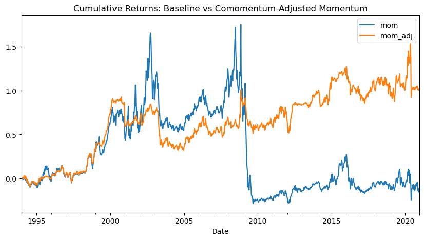
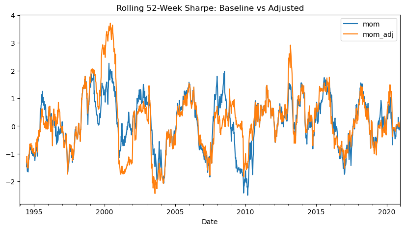
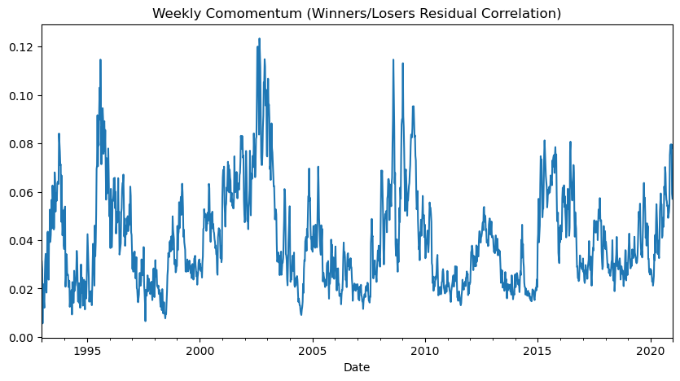

# Co-momentum: Using Crowding to Time Momentum

  

Replication and extension of Lou-Polk co-momentum on 7,216 US equities, weekly, 1992-2020
(~10.9M stock-week observations). Co-momentum — the average abnormal-return correlation inside
winner and loser deciles — proxies for arbitrage crowding, and is used here as a state variable
to scale momentum exposure.

## Key results

| Metric | Standard momentum | Co-momentum-adjusted |
|---|---|---|
| Sharpe | 0.08 | **0.29** |
| Sortino | 0.11 | **0.39** |
| Max drawdown | -74.2% | **-31.4%** |
| Ann. volatility | 20.1% | 11.4% |

*Rolling 52-week Sharpe: the overlay adds most value exactly where theory predicts — the 2008-09 crowding unwind.*

- The larger relative gain in **Sortino** vs Sharpe confirms the overlay works where it should:
  cutting downside, especially the 2009 momentum crash.
- Standard momentum's Fama-MacBeth premium is statistically indistinguishable from zero over
  this sample (t = 0.73) — consistent with the crash literature — which is exactly why a
  conditioning signal adds value.
- Exposure rule: `w_t = clip(1 - lambda * z(CoMOM_{t-1}), w_min, w_max)`, with lambda selected by
  **time-series cross-validation** on a Sortino-with-drawdown-penalty objective (no look-ahead).

## Method

1. 48-week momentum signal skipping the most recent 4 weeks (Jegadeesh-Titman).
2. Weekly Fama-MacBeth cross-sectional regressions.
3. Co-momentum: rolling 52-week average pairwise correlation of Fama-French-adjusted residuals
   within winner and loser deciles (Lou-Polk).

4. Crowding-scaled exposure with CV-tuned sensitivity; evaluation via Sharpe/Sortino, drawdowns
   and rolling 52-week Sharpe across regimes.

## Data

`data/` contains the Fama-French factors and stock metadata. The weekly returns panel
(US_Returns.csv, ~57MB) is not committed; it derives from CRSP-style weekly total returns for US
common stocks 1992-2020 — any equivalent panel with the same shape (dates x tickers) drops in.

## Honest caveats

- Signal is weak unconditionally; the value is in risk control, not raw alpha.
- No transaction costs in the backtest; weekly rebalancing of decile portfolios is not free.
- Cross-sectional Fama-MacBeth slopes on the adjusted characteristic deteriorate — the overlay
  helps the portfolio, not the pricing of the characteristic. Both results are reported.

## Attribution

Group project at Bayes Business School (MSc Mathematical Trading & Finance) with Rodrigo Lopez
Soler, Kshitij Shetty and Sebastien Van der Heyden. Repository restructuring and docs are mine.
